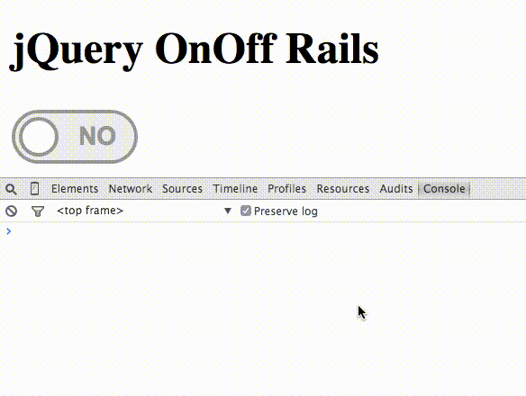

# jQuery OnOff Rails [](https://badge.fury.io/gh/berikin%2Fjquery-onoff-rails.svg)[](https://travis-ci.org/berikin/jquery-onoff-rails)
Rails wrapper for the jQuery OnOff plugin, transform checkboxes into toggle switches.




[From original jQuery OnOff repository:](https://github.com/timmywil/jquery.onoff)

Toggle switches made for the web are often solely constructed
to change when clicked or tapped,
animating side-to-side as they toggle.
That's a good start, but some people like to *slide* toggle
switches.
Javascript is used for creation and for adding the sliding functionality, but
the toggle is purely CSS.

Customize the look of your toggle switch using [proto.io's generator](http://proto.io/freebies/onoff/).

## Installation

Add this line to your application's Gemfile:

```ruby
gem 'jquery-onoff-rails', '~> 0.4.0'
```

and run `bundle install`.

Or install it yourself as:

```ruby
gem install jquery-onoff-rails
```

## Usage

In your `application.css`, include ONE of the css file:

```css
/*
 * English version
 *= require jquery.onoff-en
 */
```

```css
/*
 * Spanish version
 *= require jquery.onoff-es
 */
```

In your `application.js`, include the js file:

```js
//= require jquery.onoff
```

In you view, use the onoff helper. It will create the input checkbox and all
other tags required to create the Onoff switch:

```ruby
<%= onoff target: "myTarget" %>
```

## Contributing

1. Fork it
2. Create your feature branch (`git checkout -b my-new-feature`)
3. Commit your changes (`git commit -am 'Added some feature'`)
4. Push to the branch (`git push origin my-new-feature`)
5. Create new Pull Request

